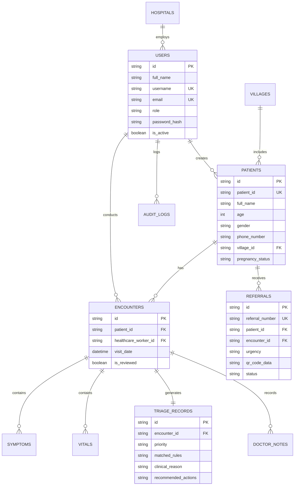

# SwasthyaSetu AI - Entity Relationship Diagram (ERD)

## Database Tables & Schema Relationships

```mermaid
erDiagram
    HOSPITALS ||--o{ USERS : employs
    VILLAGES ||--o{ PATIENTS : includes
    USERS ||--o{ PATIENTS : creates
    PATIENTS ||--o{ ENCOUNTERS : has
    USERS ||--o{ ENCOUNTERS : conducts
    ENCOUNTERS ||--o{ SYMPTOMS : contains
    ENCOUNTERS ||--o{ VITALS : contains
    ENCOUNTERS ||--|| TRIAGE_RECORDS : generates
    PATIENTS ||--o{ REFERRALS : receives
    ENCOUNTERS ||--o{ DOCTOR_NOTES : records
    USERS ||--o{ AUDIT_LOGS : logs

    USERS {
        string id PK
        string full_name
        string username UK
        string email UK
        string role
        string password_hash
        boolean is_active
    }

    PATIENTS {
        string id PK
        string patient_id UK
        string full_name
        int age
        string gender
        string phone_number
        string village_id FK
        string pregnancy_status
    }

    ENCOUNTERS {
        string id PK
        string patient_id FK
        string healthcare_worker_id FK
        datetime visit_date
        boolean is_reviewed
    }

    TRIAGE_RECORDS {
        string id PK
        string encounter_id FK
        string priority
        string matched_rules
        string clinical_reason
        string recommended_actions
    }

    REFERRALS {
        string id PK
        string referral_number UK
        string patient_id FK
        string encounter_id FK
        string urgency
        string qr_code_data
        string status
    }
```
